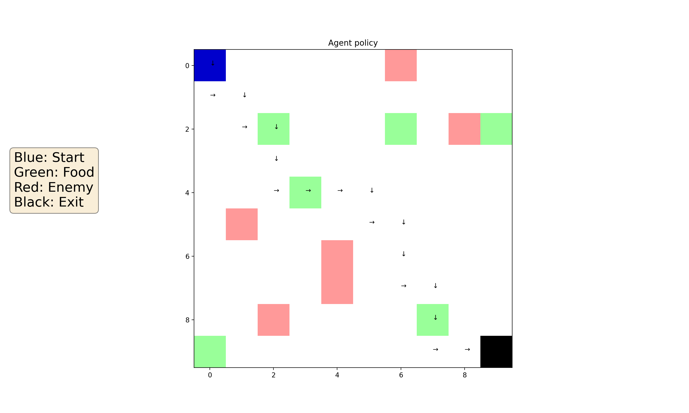
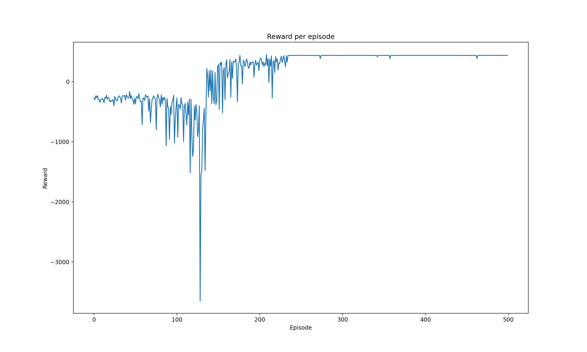

# blobGame-RL




## Getting Started

1.) setup env

2.) clone repo

4.) activate env

5.) install requirements

6.) run

``
python3 -m venv RL
``
``
cd RL
``
``
git clone "LINK TO REPO"
``
``
source bin/activate
``
pip3 install requirements.txt
``
python3 main.py
``

### Prerequisites
numpy, matplotlib
```
pip3 install requirements.txt
```

## Authors
Tristan Shah

## Credits
Sentdex - inspiration for blobGame
Reinforcement Learning: 
	Ritchard S Sutton
	Andrew G Barto
## License

This project is licensed under the MIT License - see the [LICENSE.md](LICENSE.md) file for details